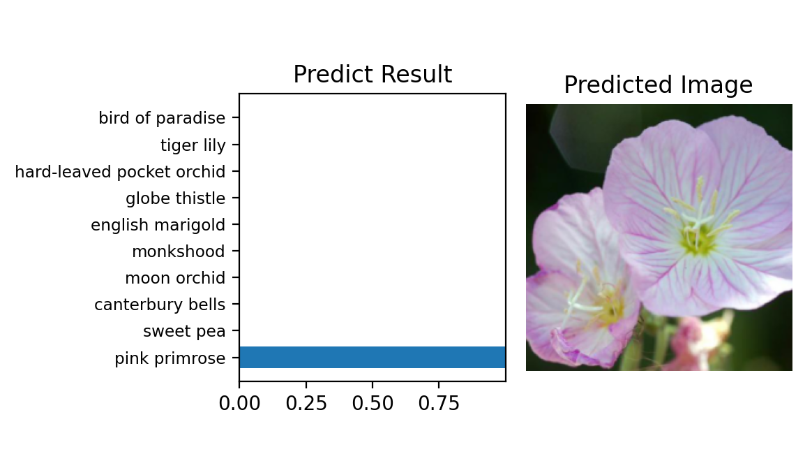

# Image Classifier

Image Classifier App is a Command Line Application that build for AI Programming with Python Nanodegree Program that provided by udacity. The main feature of the app is to classifiy Image using pretrained model like vgg16.

## Library 
The library the has been used to develop this app.

| Library | Link |
| ------ | ------ |
| pytorch | https://pytorch.org/ |
| matplotlib | https://matplotlib.org/ |
| numpy | https://numpy.org/ |
| json | https://docs.python.org/3/library/json.html |
| argparse | https://docs.python.org/3/library/argparse.html |
| torchvision | https://pytorch.org/docs/stable/torchvision/index.html |
| PIL | https://pillow.readthedocs.io/en/stable/|
|time | https://www.programiz.com/python-programming/time |


# Usage
### Training Commands
##### General Form

```
python3 train.py data_dir --learning_rate LEARNING_RATE --epochs EPOCHS --save_dir SAVE_DIR
```
##### Example
example for this specific parameters:
- data_dir  : "flowers_10"
- learning_rate : 0.0001
- epochs : 6
- save_dir : checkpoint.pth
```
python3 train.py flowers_10 --learning_rate 0.0001 --epochs 6 --save_dir checkpoint.pth
```
### Training Result
```
Argument Info
data_dir : flowers_10
save_dir : checkpoint.pth
learning_rate : 0.0001
epochs : 6
Start Training
Epoch: 1/6..  Training Loss: 6.643..  Test Loss: 5.841..  Test Accuracy: 0.116
Epoch: 1/6..  Training Loss: 5.228..  Test Loss: 3.421..  Test Accuracy: 0.116
Epoch: 2/6..  Training Loss: 3.153..  Test Loss: 2.428..  Test Accuracy: 0.256
Epoch: 2/6..  Training Loss: 2.603..  Test Loss: 2.281..  Test Accuracy: 0.279
Epoch: 3/6..  Training Loss: 2.460..  Test Loss: 1.440..  Test Accuracy: 0.605
Epoch: 3/6..  Training Loss: 1.881..  Test Loss: 1.309..  Test Accuracy: 0.512
Epoch: 3/6..  Training Loss: 1.851..  Test Loss: 1.119..  Test Accuracy: 0.558
Epoch: 4/6..  Training Loss: 1.470..  Test Loss: 0.931..  Test Accuracy: 0.698
Epoch: 4/6..  Training Loss: 1.170..  Test Loss: 0.873..  Test Accuracy: 0.651
Epoch: 5/6..  Training Loss: 1.024..  Test Loss: 0.784..  Test Accuracy: 0.651
Epoch: 5/6..  Training Loss: 0.807..  Test Loss: 0.565..  Test Accuracy: 0.837
Epoch: 6/6..  Training Loss: 0.754..  Test Loss: 0.461..  Test Accuracy: 0.837
Epoch: 6/6..  Training Loss: 0.690..  Test Loss: 0.385..  Test Accuracy: 0.884
Epoch: 6/6..  Training Loss: 0.468..  Test Loss: 0.360..  Test Accuracy: 0.907
End Training
The total training time: 42.188 minuates
Saved to checkpoint.pth
```
### PredictCcommands
##### General Form

```
python3 predict.py image_path checkpoint --top_k TOP_K --category_names CATEGORY_NAMES 
```
##### Example
example for this specific parameters:
- image_path  : "flowers_predict/image_06763.jpg"
- checkpoint : checkpoint.pth
- top k : 10
- category names : cat_to_name_10.json
```
python3 predict.py flowers_predict/image_06763.jpg checkpoint.pth --top_k 10 --category_names cat_to_name_10.json 
```
### Predict Result
```
Argument Info
image_path : flowers_predict/image_06763.jpg
checkpoint : /Users/Apple/Documents/python_IA/Image_Classifier/train/checkpoint.pth
top k : 10
category names : cat_to_name_10.json
Predict Result
('pink primrose', 0.99950004)
('sweet pea', 0.00045578534)
('canterbury bells', 2.4515823e-05)
('moon orchid', 1.9176043e-05)
('monkshood', 2.6036224e-07)
('english marigold', 1.32129e-07)
('globe thistle', 5.6247494e-08)
('hard-leaved pocket orchid', 7.674287e-09)
('tiger lily', 9.374542e-10)
('bird of paradise', 4.8567556e-10)
```



License
---

MIT


